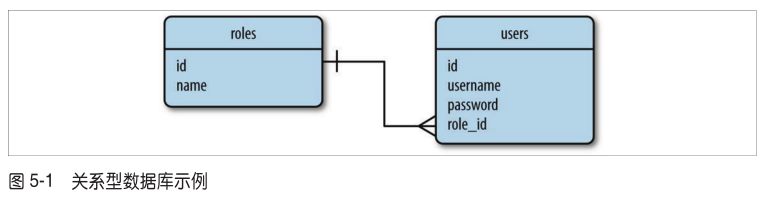
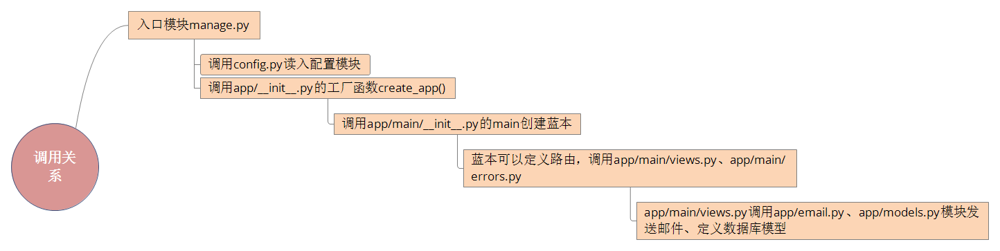
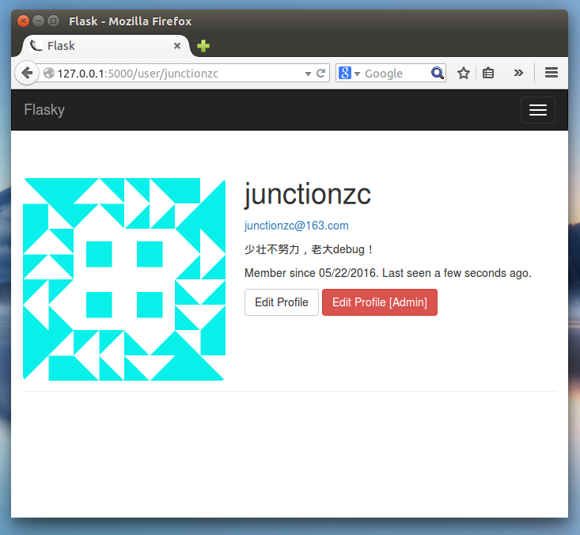
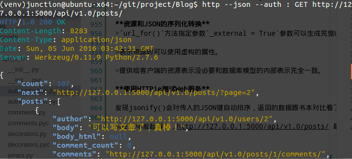

# Flask入门学习笔记
**配合《Flask Web开发：基于Python的Web应用开发实战》学习**

*****
**6月9日**

我使用`Visual Studio Code`打开此项目

本地运行说明：

* 在虚拟环境中下载依赖包：
```
(venv) $ pip install requirements/dev.txt
```

* shell中设置环境变量（替换*内容，主要用于邮件发送）：
```
export MAIL_SENDER=****
export FLASKY_ADMIN=****
export MAIL_USERNAME=****
export MAIL_PASSWORD=****
```

* 执行单元测试：
```
python manage.py test
```

*****

## **chapter 1**
### 虚拟环境virtualenv
1. 安装virtualenv包：`$ sudo apt-get install python-virtualenv`
2. 创建虚拟环境：`$ virtualenv venv`
3. 激活虚拟环境：`$ source venv/bin/activate`
4. 退出虚拟环境：`$ deactivate`

### Flask
1. 安装Flask：`(venv) $ pip install flask`
2. 检查Flask是否安装正确：
```
(venv) $ python
>> import flask
>> 
```
没有看见错误证明Flask安装正确

## **chapter 2**
### Jinja2模板引擎
>为了分离业务逻辑和表现逻辑，一般使用模板，模板是一个包含响应文本的文件，用占位符表示动态部分，渲染就是用真实值替换变量，再返回最终得到的响应字符串，Flask使用Jinja2模板引擎渲染模板。

Jinja2提供很多过滤器来修改变量，**注意：千万别在不可信的值上使用safe过滤器，例如用户在表单中输入的文本**

## **chapter 3**
### Bootstrap
>Bootstrap是Twitter开发的一个开元框架，提供的用户组界面可用于创建整洁且具有吸引力的网页。

1. 安装Bootstrap:`(venv) $ pip install flask-bootstrap`

**模板的继承**

语法：``

**模板继承的一个例子**

基模板中定义了如下block：
```

<div class="container">
    
</div>

```
衍生模板继承：
```

<div class="page-header">
    <h1>Not Found</h1>
</div>

```
效果等同于：
```

<div class="container">
    <div class="page-header">
        <h1>Not Found</h1>
    </div>
</div>

```

**链接**

`url_for()`函数可以利用视图函数名生成URL信息，例如：
>在当前版本的`hello.py`程序中调用`url_for('index')`得到的结果是`/`。调用`url_for('index', _external=True)`返回的则是绝对地址，在这个示例中是`http://localhost:5000/` 。

**静态文件**

对静态文件的引用会被当成一个特殊路由，不需要编写相应的视图函数，例如：
>调用`url_for('static', filename='css/styles.css', _external=True)`得到的结果是`http://localhost:5000/static/css/styles.css` 。

>默认设置下，Flask在程序根目录中名为`static`的子目录中寻找静态文件。如果需要，可在`static`文件夹中使用子文件夹存放文件。服务器收到前面那个URL后，会生成一个响应，包含文件系统中`static/css/styles.css`文件的内容。

>**注意：要使用super()保留基模板中定义的块的原始内容（虽然还不太理解，但被这个坑了一下，没有super()样式就全乱了）。**

**使用Flask-Moment本地化日期和时间**

为了在服务器使用统一的时间，而用户浏览器看到的是本地化的时间，利用开源库`moment.js`在浏览器中渲染日期和日期，Flask-Moment是封装`moment.js`的一个Flask扩展。

1. 安装Flask-Moment扩展:`(venv) $ pip install flask-moment`

## **chapter 4**
### Web表单
>生成表单的HTML代码和验证提交表单的数据是一些很单调的任务，Flask-WTF扩展可以简化这些过程。

1. 安装Flask-WTF扩展:`(venv) $ pip install flask-wtf`
2. 设置密匙以防止跨站请求伪造的攻击:`app.config['SECRET_KEY'] = 'hard to guess string'`

**表单类**

>使用Flask-WTF时，每个Web表单都由一个继承自Form的类表示。这个类定义表单中的一组字段，每个字段都用对象表示。字段对象可附属一个或多个验证函数。验证函数用来验证用户提交的输入值是否符合要求。

>例如`StringField('What is your name?', validators=[Required()])`,validators指定一个由验证函数组成的**列表**，在接受用户提交的数据之前验证数据。

>Form基类由Flask-WTF扩展定义，从flask.ext.wtf中导入；字段和验证函数直接从WTForms导入：
```
from flask.ext.wtf import Form
from wtforms import StringField, SubmitField
from wtforms.validators import Required
```

**把表单渲染成HTML**

>当浏览器请求页面时，显示表单的一种方法是利用视图函数把一个`NameForm`类实例通过参数form传入模板，在模板中生成一个简单的表单，但是这种方式太过繁琐。尽量使用Bootstrap中的表单样式，利用Flask-Bootstrap提供的一个非常高端的辅助函数渲染整个Flask-WTF表单：
```

{{ wtf.quick_form(fomr) }}
```

**在视图函数中处理表单**

* 提交表单通常使用`post`的方式。
* `NameForm`类实例的`validate_on_submit()`方法在所有验证函数通过时返回True。

<font color="red">如果服务器收到一个没有表单数据的GET请求，validate_on_submit()函数将返回False。</font>

**重定向和用户会话**

刷新页面时浏览器会重新发送之前已经发送的最后一个请求，如果这是一个post请求，刷新页面就会重新post，可以使用Post/重定向/Get模式这种技巧。但是这种方式的缺点时会丢失上一次post的数据，可以使用通过session在请求之间”记住“数据。

**Flash消息**

在模板中取flash消息:``，使用循环的原因是可能有多个消息在排队等待显示，这个应该是获取消息队列中的下一个消息。

`get_flashed_messages()`函数刷新之后不会再次返回，所以刷新之后flash消息会消失。书上面的这两句话没有因果关系，搞得我看了半天:
>在模板中使用循环是因为在之前的请求循环中每次调用`flash()`函数时都会生成一个消息，所以可能有多个消息在排队等待显示。`get_flashed_messages()`函数获取的消息在下次调用时不会再次返回，因此Flash消息只显示一次，然后就消失了。

## **chapter 5**
### 数据库
>Web程序最常用基于关系模型的数据库，这种数据库也称为SQL数据库，因为它们使用结构化查询语言。不过最近几年文档数据库和键值对数据库成了流行的替代选择，这两种数据库合称NoSQL数据库。

<font color="red">第一次看这章，看不太懂，不知道在讲什么，估计是因为我对数据库的一些概念还不太了解吧。以下笔记来自第二次阅读。</font>

**SQL数据库**

**主键**用于唯一标识某一行，**外键**用于引用同一个表或不同表中某行的主键。

SQL数据库复杂的地方是需要将表联结起来，优点是存储数据高效，能避免重复。

**NoSQL数据库**

>NoSQL数据库一般使用集合代替表，使用文档代替记录。

<font color="red">当前还不是很理解上面这句话。</font>

>NoSQL数据库所采用的设计方式使联结变得困难，所以大多数数据库根本不支持这种操作。

**Python数据库框架**

SQLAlchemy是一个数据库抽象层代码包，初步理解是为多种数据库引擎提供抽象层，使得应用不用处理底层的数据库实体<font color="red">（可能理解有误）</font>。

>抽象层，也称为对象关系映射（Object-Relational Mapper, ORM）或对象文档映射（Object-Document Mapper, ODM）。

**使用Flask-SQLAlchemy管理数据库**
>Flask-SQLAlchemy是一个Flask扩展，简化了在Flask程序中使用SQLAlchemy的操作。SQLAlchemy是一个很强大的关系型数据库框架，支持多种数据库后台。SQLAlchemy提供了高层ORM，也提供了使用数据库原生SQL的低层功能。

1. 安装Flask-SQLAlchemy:`(venv) $ pip install flask-sqlalchemy`

>配置对象有一个很有用的选项，即`SQLALCHEMY_COMMIT_ON_TEARDOWN`键，将其设为True时，每次请求结束后都会自动提交数据库中的变动。

**定义模型**



示例，定义Role和User模型：
```
class Role(db.Model):
    __tablename__ = 'roles'
    id = db.Column(db.Integer, primary_key = True)
    name = db.Column(db.String(64), unique = True)
    
    def __repr__(self):
        return '<Role %r>' % self.name

class User(db.Model):
    __tablename__ = 'users'
    id = db.Column(db.Integer, primary_key = True)
    username = db.Column(db.String(64), unique = True, index = True)
    
    def __repr__(self):
        return '<User %r>' % self.username
```
>类变量`__tablename__`定义在数据库中使用的表名。

>db.Column类构造函数的第一个参数是数据库列和模型属性的类型，其余参数指定属性的配置选项，比如`primary_key=True`表明这列是表的主键。

**关系**

示例，关系：
```
class Role(db.Model):
    # ...

class User(db.Model):
    # ...
    role_id = db.Column(db.Integer, db.ForeignKey('roles.id'))
```
>添加到User模型中的role_id列被定义为外键，传给db.ForeignKey()的参数'roles.id'表明，这列的值是roles表中行的id值。

>db.relationship()中的backref参数向User模型中添加一个role属性，定义反向关系<font color='red'>（当前对于这句话不是太理解）</font>。这一属性可替代role_id访问Role模型，此时获取的是模型对象，而不是外键的值。

<font color='red'>另外书中关于其他的关系类型描述那段话也还不太理解。</font>

**数据库操作**

1.创建表：
```
启动python shell：
(venv) $ python hello.py shell
>>> from hello import db
>>> db.create_all()
```
2.添加一些角色和用户：
```
>>> from hello import Role, User
>>> admin_role = Role(name = 'Admin')
>>> user_role = Role(name = 'User')
>>> user_john = User(username = 'susan', role = user_role)
```
3.添加到会话并提交会话以把对象写入数据库：
```
>>> db.session.add(admin_role)
>>> db.session.add(user_role)
>>> db.session.add(user_john)
>>> db.session.commit()
```

4.查询行：
```
>>> Role.query.all()
>>> User.query.all()
```
5.通过过滤器更精确查询行：
```
>>> User.query.filter_by(role=user_role).all()
```

关于查询的另外一个示例：
```
>>> user_role = Role.query.filter_by(name = 'User').first()
```
以上返回一个更精确的query对象。
```
>>> users = user_role.users
```
`user_role.users`表达式隐含的查询会调用all()返回一个用户列表，但无法指定更精确的查询过滤器。解决方法：修改关系设置，加入`lazy='dynamic'`参数，从而禁止自动查询：
```
class Role(db.Model):
    # ...
    users = db.realtionship('User', backref = 'role', lazy = 'dynamic')
    # ...
```
配置之后，user_role.users会返回一个尚未执行的查询，因此可以在其上添加过滤器：
```
>>> user_role.users.order_by(User.username).all()
```

**在视图函数中操作数据库**

更新`hello.py`：
```
@app.route('/', methods = ['GET', 'POST'])
def index():
    form = NameForm()
    if form.validate_on_submit():
        user = User.query.filter_by(username = form.name.data).first()
        if user is None:
            user = User(username = form.name.data)
            db.session.add(user)
            session['known'] = False
        else:
            session['known'] = True
        session['name'] = form.name.data
        return redirect(url_for('index'))
    return render_template('index.html', form = form, name = session.get('name'),
                           known = session.get('known', False))
```
更新`index.html`模板：
```



Flasky


<div class="page-header">
    <h1>Hello, {{ name }}Stranger!</h1>
    
    <p>Pleased to meet you!</p>
    
    <p>Happy to see you again!</p>
    
</div>
{{ wtf.quick_form(form) }}

```

**集成Python shell**

集成的目的是为了偷懒，不用每次启动Python shell创建数据库或插入行都要`import db, Role, User`，方法：为shell命令注册一个make_context()回调函数：
```
from flask.ext.script import Shell
def make_shell_context():
    return dict(app = app, db = db, User = User, Role = Role)
manager.add_command("shell", Shell(make_context = make_shell_context))
```

**使用Flask-Migrate实现数据库迁移**
>Flask-Migrate扩展对数据库迁移框架Alembic做了轻量级包装。

安装Flask-Migrate:`(venv) $ pip install flask-migrate`

1.创建迁移仓库：
```
(venv) $ python hello.py db init
```

2.创建迁移脚本：
```
(venv) $ python hello.py db migrate -m "initial migration"
```
以上会报一个warning：
```
UserWarning: SQLALCHEMY_TRACK_MODIFICATIONS adds significant overhead and will be disabled by default in the future.  Set it to True to suppress this warning.
```
消除warning的方法：修改`venv/lib/python2.7/site-packages/flask_sqlalchemy/__inin__.py`第797行，将`track_modifications = app.config.setdefault('SQLALCHEMY_TRACK_MODIFICATIONS', None)`中的`None`改成`True`。

3.更新数据库：
```
(venv) $ python hello.py db upgrade
```

<font color='color'>注意：以上数据库的迁移我执行后有问题，貌似创建的时候就出问题了，恢复不了，暂时不清楚为什么。</font>

*****
**2016年5月21日更新**

学完第9章，终于解决了数据库迁移的问题，在这之前，一直用书本git仓库的数据库（--!）

数据库迁移框架的作用是当你修改了数据库的模型，比如增加了某一列，不要影响原来的数据，还可以备份原来的数据库模型。

之前按照书本创建迁移脚本，一直提示这个：
```
INFO  [alembic.env] No changes in schema detected.
```

书中有这么一行字：
>自动创建的迁移会根据模型定义和数据库当前之间的差异生成upgrade()和downgrade()函数的内容。

**意思是说当数据库模型没有被更改，是创建不了迁移脚本的。所以第5章创建迁移脚本的正确打开方式是：先不用管，待到后面修改了Role和User模型再来运行迁移脚本和更新数据库即可**
*****

## **chapter 6**
### **电子邮件**

相对来说这一章比较简单

在程序中发送电子邮件：
```
from flask.ext.mail import Message

app.config['MAIL_SERVER'] = 'smtp.163.com'
app.config['MAIL_PORT'] = 25
app.config['MAIL_USE_TLS'] = True
app.config['MAIL_USERNAME'] = os.environ.get('MAIL_USERNAME')
app.config['MAIL_PASSWORD'] = os.environ.get('MAIL_PASSWORD')
app.config['FLASKY_MAIL_SUBJECT_PREFIX'] = '[Flasky]'
app.config['FLASKY_MAIL_SENDER'] = os.environ.get('MAIL_SENDER')
app.config['FLASKY_ADMIN'] = os.environ.get('FLASKY_ADMIN')

def send_async_email(app, msg):
    with app.app_context():
        mail.send(msg)

def send_email(to, subject, template, **kwargs):
    msg = Message(app.config['FLASKY_MAIL_SUBJECT_PREFIX'] + subject, 
                  sender = app.config['FLASKY_MAIL_SENDER'], recipients=[to])
    msg.body = render_template(template + '.txt', **kwargs)
    msg.html = render_template(template + '.html', **kwargs)
    thr = Thread(target = send_async_email, args = [app, msg])
    thr.start()
    return thr
    
@app.route('/', methods = ['GET', 'POST'])
def index():
    form = NameForm()
    if form.validate_on_submit():
        user = User.query.filter_by(username = form.name.data).first()
        if user is None:
            # ...
            if app.config['FLASKY_ADMIN']:
                send_email(app.config['FLASKY_ADMIN'], 'New User',
                           'mail/new_user', user = user)
            # ...
```

发送邮件移到线程里面去执行，缺点是每一个邮件都要新建一个线程不太合适，改进方法是将`send_async_email()`函数的操作发给Celery任务队列。

<font color='red'>上面使用了网易的smtp服务器，偶尔能发送成功，经常抽风，不知道为什么，账户、密码、发件邮箱地址、收件邮箱地址都从环境变量中读入。</font>

## **chapter 7**
### **大型程序的结构**
<font color='red'>第一次看这章，看得云里雾里，蓝本的概念不知道讲的什么。对整个结构理解很乱，这种感觉就像按照前面的步骤装好了一个玩具，然后把它拆散，再装一个功能一样但外形不一样的玩具，模块与模块之间怎么耦合一下子完全没有概念。</font>

前后来回看了5次这章，终于稍微清晰了一点，目录结构如下：
```
.
├── app
│   ├── email.py
│   ├── __init__.py
│   ├── main
│   │   ├── errors.py
│   │   ├── forms.py
│   │   ├── __init__.py
│   │   └── views.py
│   ├── models.py
│   ├── static
│   │   └── favicon.ico
│   └── templates
│       ├── 404.html
│       ├── 500.html
│       ├── base.html
│       ├── index.html
│       ├── mail
│       │   ├── new_user.html
│       │   └── new_user.txt
│       └── user.html
├── config.py
├── manage.py
├── migrations
│   ├── alembic.ini
│   ├── env.py
│   ├── README
│   ├── script.py.mako
│   └── versions
├── readme.md
├── requirements.txt
├── sqlite-example.png
└── tests
    ├── __init__.py
    └── test_basics.py
```
大致调用关系图如下：


总体来说这章讲得有点混乱，要多读几次，但其实结构也不是很复杂。暂时理解蓝本的作用：在创建app之后定义路由。

**一些需要注意的地方：**

1.配置可以使用Flask app.config配置提供的from_object()方法直接导入程序：
```
def create_app(config_name):
    app = Flask(__name__)
    app.config.from_object(config[config_name])
    config[config_name].init_app(app)
    # ...
```
其中`config[config_name].init_app(app)`当前定义为空。

书中未给出的几个文件源码如下：

app/email.py:
```
from threading import Thread
from flask.ext.mail import Mail
from flask.ext.mail import Message
from flask import current_app, render_template
from . import mail

def send_async_email(app, msg):
    with app.app_context():
        mail.send(msg)

def send_email(to, subject, template, **kwargs):
    app = current_app._get_current_object()
    msg = Message(app.config['FLASKY_MAIL_SUBJECT_PREFIX'] + subject, 
                  sender = app.config['FLASKY_MAIL_SENDER'], recipients=[to])
    msg.body = render_template(template + '.txt', **kwargs)
    msg.html = render_template(template + '.html', **kwargs)
    thr = Thread(target = send_async_email, args = [app, msg])
    thr.start()
    return thr
```
**以上要注意的一点是`from flask import current_app`和`app = current_app._get_current_object()`这一句，原来的直接引用app在这里会报错，因为app未定义，app/main/views.py里面的app也要改成current_app。current_app应该是程序上下文，还不怎么理解。**

app/models.py:
```
from . import db

class Role(db.Model):
    __tablename__ = 'roles'
    id = db.Column(db.Integer, primary_key = True)
    name = db.Column(db.String(64), unique = True)
    users = db.relationship('User', backref = 'role', lazy = 'dynamic')
    
    def __repr__(self):
        return '<Role %r>' % self.name

class User(db.Model):
    __tablename__ = 'users'
    id = db.Column(db.Integer, primary_key = True)
    username = db.Column(db.String(64), unique = True, index = True)
    role_id = db.Column(db.Integer, db.ForeignKey('roles.id'))
    
    def __repr__(self):
        return '<User %r>' % self.username
```

程序默认使用`DevelopmentConfig`配置，数据库需要自己创建，但这个目录结构在shell中创建数据库非常麻烦，因为db未初始化，这跟之前的第5章不同。这里直接使用第5章的数据库文件就ok，名字改成`data-dev.sqlite`。

在运行时需要设置的环境变量（Linux系统，替换下面的*，但是没什么卵用，163邮箱继续抽风）：
```
export MAIL_SENDER=*****
export FLASKY_ADMIN=*****
export MAIL_USERNAME=*****
export MAIL_PASSWORD=*****
```

******
**2016年5月15日更新**

找到原因了，邮件发不出去是因为网易smtp服务器把这当成了垃圾邮件，看这错误：
```
SMTPDataError: (554, 'DT:SPM 163 smtp9,DcCowABnlycHFDhXNLdrAA--.30082S3 1463292937,please see http://mail.163.com/help/help_spam_16.htm?）
```
貌似网易还会封一段时间ip（晕）。so，暂时把邮件功能屏蔽掉，看来邮件这个问题是个不小的问题啊。

**2016年5月19日更新**

邮箱改成QQ邮箱，发送邮件ok，注意密码不是QQ密码，需要在邮箱设置里面开通SMTP服务，然后生成一个授权码，这个授权码才是密码。
******

最后的单元测试看不太懂，主要是程序上下文的理解。`setUp()`和`tearDown()`方法分别在测试前后运行，以test开头的方法都是测试方法。以下这句测试的是什么？
```
self.assertTrue(current_app.config['TESTING'])
```
书中一句带过，`确保程序在测试配置中运行`？

关于单元测试的更多内容，可以参考这里：http://www.liaoxuefeng.com/wiki/001374738125095c955c1e6d8bb493182103fac9270762a000/00140137128705556022982cfd844b38d050add8565dcb9000

## **chapter 8**
### 用户认证

**密码安全性**

不能以明文存储密码，如果网站受到攻击，被人脱裤了，所有用户密码都会暴露，要存储密码生成的散列值。散列值不能反推出密码，但可以用来验证密码。实现以上功能可以使用Werkzeug的security模块。


**创建认证蓝本**

注册蓝本：`app.register_blurprint(auth_blueprint, url_prefix = '/auth')`

>`url_prefix`是可选参数，如果使用，注册后蓝本中定义的所有路由都会加上指定前缀。

**使用Flask-Login认证用户**
>Flask-Login专门用来管理用户认证系统中的认证状态，且不依赖特定的认证机制。

安装Flask-Login扩展：`(venv) $ pip install flask-login`

要使用Flask-Login扩展，程序的User模型需要实现`is_authenticated`、`is_active`、`is_anonymous`、`get_id()`4个方法，一种简单的替代方案是在User模型传入一个Flask-Login提供的`UserMinxin`类，其中包含这些方法的默认实现：
```
from flask.ext.login import UserMixin

class User(UserMiXin, db.Model):
    # ...
```

Flask-Login在程序的工厂函数中初始化：

`app/__init__.py:`
```
from flask.ext.login import LoginManager

login_manager = LoginManager()
login_manager.session_protection = 'strong'
login_manager.login_view = 'auth.login'

def create_app(config_name):
    # ...
    login_manager.init_app(app)
    # ...
```

login_view属性设置登录页面的端点，因登录路由在蓝本中定义，因此要在前面加上蓝本的名字。

>为了保护路由只让认证用户访问，Flask-Login提供了一个login_required修饰器，用法演示如下：

```
from flask.ext.login import login_required

@app.route('/secret')
@login_required
def secret():
    return 'Only authenticated users are allowed!'
```

关于这句代码的解释：
```
return redirect(request.args.get('next') or url_for('main.index'))
```

>用户访问未授权的URL时会显示登录表单，Flask-Login会把原地址保存在查询字符串的next参数中，这个参数可从request.args字典中读取。如果查询字符串中没有next参数，则重定向到首页。

**注册新用户**

`app/auth.forms.py:`

```
class RegistrationForm(Form):
    # ...
    def validate_email(self, field):
        # ...
    def validate_username(self, field):
        # ...
```

>如果表单类中定义了以validate_开头且后面跟着字段名的方法，这个方法就和常规的验证函数一起调用。自定义的验证函数要想表示验证失败，可以抛出ValidationError异常，其参数就是错误信息。

记得在用户注册路由`app/auth/views.py`中`import RegistrationForm`
```
from .forms import LoginForm, RegistrationForm
```

**确认账户**

确认邮件中最简单的确认链接是`http://www.example.com/auth/confirm/<id>`这种形式的URL，但这样很不安全，任何人都可以伪造这个链接帮别的用户确认邮件地址。一种解决方法是把令牌发过去，令牌可以设置过期时间。一个示例：

```
(venv) $ python manage.py shell
>>> from manage import app
>>> from itsdangerous import TimedJSONWebSignatureSerializer as Serializer
>>> s = Serializer(app.config['SECRET_KEY'], expires_in = 3600)
>>> token = s.dumps({'confirm': 23 })
>>> token
'eyJhbGciOiJIUzI1NiIsImV4cCI6MTM4MTcxODU1OCwiaWF0IjoxMzgxNzE0OTU4fQ.ey ...'
>>> data = s.loads(token)
>>> data
{u'confirm': 23}
```

>itsdangerous提供多种生成令牌的方法，`TimedJSONWebSignatureSerializer`类生成具有过期时间的JSON Web签名。dumps()方法为指定的数据生成一个加密签名，然后再对数据和签名进行序列化，生成令牌字符串。loads()方法用于解码令牌。

>若想着蓝本中使用针对程序全局请求的钩子，必须使用`before_app_request`修饰器。

示例8-22的'static'后面应该是'\'，另外这两句没怎么看懂：
```
and request.endpoint[:5] != 'auth.' \
and request.endpoint != 'static'
```


**管理用户**
修改密码、重设密码、修改电子邮件地址这部分都是些体力活，主要步骤：

* 在`app/auth/forms.py`中定义表单相应的类
* 在`app/auth/views.py`中添加相应的路由
* 增加相应的页面模板

## **chapter 9**
### 用户角色

学完这章终于对数据库迁移有了比较清晰的认识，也解决了之前的数据库迁移失败的问题。关于数据库迁移的说明，更新到了上面的第5章，这里不再重复。

**这章的正确打开方式是：修改了Role模型，先运行`python manage.py db upgrade`迁移数据库，然后再把角色写入数据库：**

```
(venv) $ python manage.py shell
>>> Role.insert_roles()
>>> Role.query.all()
[<Role u'Administrator'>, <Role u'User'>, <Role u'Moderator'>]
```

`app/decorators.py`的自定义修饰器没怎么看懂，先跳过。

至此，也终于把两个一直没有解决的问题“邮件”和“数据库迁移”都解决了，理解第7章到第9章，整整花了一周的时间，今天星期六，感觉我确实该休息一下了。

## **chapter 10**
### 用户资料

**资料信息**

>db.String和db.Text的区别在于后者不需要指定最大长度

一些需要注意的地方：

* 需要在`app/models.py`中引入`datetime`：
```
from datetime import datetime
```

**用户资料页面**

一些需要注意的地方：

* 需要在`app/main/views.py`中引入`User`:
```
from ..models import User
```

需要引入的模块根据错误修改，对比原来flask仓库对应的版本，后面不再重复写这些繁琐的部分。

* 更改了模型之后先要创建迁移脚本，再更新数据库模型:
```
python manage.py db migrate -m "xxxx"
python manage.py db upgrade
```

**资料编辑器**

>WTForms对HTML表单控件select进行SelectField包装，从而实现下拉列表，用来在这个表单中选择用户角色。SelectField实例必须在其choices属性中设置各选项。选项必须是一个由元组组成的列表，各元组都包含两个元素：选项的标识符和显示在控件中的文本字符串。

>用于选择用户角色的SelectField，设定这个字段的初始值时，role_id被赋值给field.role.data，表单提交后，id从字段的data属性中提取。表单中声明SelectField时使用`coerce=int`参数保证这个字段的data属性值是整数。

*****
**2016年5月22日 21：45 星期天**

跟着书本编，最主要的问题还是变量名字拼写错误，出现些奇奇怪怪的问题，比如将`insert_roles()`方法中的`role.permissions`写成`role.permission`，设置角色的时候出现错误，debug了一晚上。
*****

**用户头像**

`www.gravatar.com`被墙了，改成没被墙的`cn.gravatar.com/avatar`。

自定义的`styles.css`要在`base.html`模板中引用：
```
<link rel="stylesheet" type="text/css" href="{{ url_for('static', filename='styles.css') }}">
```

效果图如下：



感觉还不错哦，^_^

## **chapter 11**
### **博客文章**

这句话没怎么看懂：
>变量current_user由Flask-Login提供，和所有上下文变量一样，也是通线程内的代理对象实现。这个对象的表现类似用户对象，但实际上却是一个轻度包装，包含真正的用户对象。数据库需要真正的用户对象，因此要调用`_get_current_object()`方法。

书本中的`app/templates/index.html`源码样式有点问题，原来是这样：
```
    # ...
    <div class="post-data">...</div>
    <div class="post-author">...</div>
    <div class="post-body">...</div>
    # ...
```
改成：
```
    # ...
    <div class="post-content">
        <div class="post-data">...</div>
        <div class="post-author">...</div>
        <div class="post-body">...</div>
    </div>
    # ...
```

将博客文章的模板移到`_posts.html`中，然后利用Jinja2提供的include()指令引入，避免重复维护两个完全相同的HTML片段。
```

```

**分页显示长博客文章列表**

使用ForgeryPy生成虚拟信息：`(venv) $ pip install forgerypy`

`User.generate_fake(xxx)`用于生成大量虚拟用户，`Post.generate_fake(xxx)`用于生成大量虚拟文章。

offset查询过滤器，会跳过参数中指定的记录数量：
```
User.query.offset(randint(0, user_count - 1)).first()
```

Flask-SQLAlchemy提供一个paginate()方法，返回一个Pagination类对象，用于分页查询数据，该对象包含很多的属性，比如items属性，返回当前页面中的记录。

*****
<font color="red">分页模板宏太长太长，第一次看没怎么看懂啊。</font>

**2016年5月28日更新**

关于分页模板模板宏，认真分析一下就理解了，主要是调用Pagination类对象的几个方法。

>Jinja2宏的参数列表中不用加入**kwargs即可接收关键字参数，分页宏把接收到的所有关键字参数都传给了生成分页链接的url_for()方法。

*****

**使用Markdown和Flask-PageDown支持富文本文章**

要像书本那样显示Markdown预览，需要在`app/static/styles.css`中定义样式，不然那个外边框是没有的，
```
div.flask-pagedown-preview {
    margin: 10px 0px 10px 0px;
    border: 1px solid #e0e0e0;
    padding: 4px;
}
div.flask-pagedown-preview h1 {
    font-size: 140%;
}
div.flask-pagedown-preview h2 {
    font-size: 130%;
}
div.flask-pagedown-preview h3 {
    font-size: 120%;
}
```
以上这几个class没有单独引入就生效了，估计是Flask-PageDown内置的预定义名称。

google了一下，CDN是内容分发网络的意思，书本上的意思是很多样式都是从CDN加载的，我试了一下断网，发现样式基本上全变了，看来没网是不行的。

>安全起见，最好只提交Markdown源文本，在服务器上使用Markdown将其转换成HTML。

markdown实时预览是通过SQLAlchemy的"set"事件监听程序实现的。

Markdown()文本到HTML转换分三步完成：
* 使用markdown()函数把Markdown文本转换成HTML。
* 使用Blench的clean()函数删除所有不在白名单的标签。
* 使用Blench的linkify()函数将纯文本中的URL转换成适当的`<a>`链接。

“博客文章的固定链接”和“博客文章编辑器”没什么可说的，跟着书一步步来就能理解。

## **chapter 12**
### **关注者**
*****
**2016年5月26日**

第一次看数据库关系这部分很难理解，有种完全看不进去的感觉，也有可能是最近太累啦，因为工作问题最近情绪太过波动，晚上下班之后就明显感觉到疲惫，智商不够用啊，但很显然，这一次，躺都要躺完的。不懂就先跳过，准备二刷。

**2016年5月29日**

高级多对多这一节的催眠能力实在是太强了，前后来回翻，睡着了3遍，还是没有看懂。。。
*****

>关联表就是一个简单的表，不是模型，SQLAlchemy会自动接管这个表。

高级多对多关系一下子理解起来很难，主要是`follower`和`followed`太像了，需要好好理清两者的关系。经过反复、来回看，应该先从表和页面从上到下开始理解：

先看代码定义的Follow模型：
```
class Follow(db.Model):
    __tablename__ = 'follows'
    follower_id = db.Column(db.Integer, db.ForeignKey('users.id'),
                            primary_key = True)
    followed_id = db.Column(db.Integer, db.ForeignKey('users.id'),
                            primary_key = True)
    timestamp = db.Column(db.DateTime, default = datetime.utcnow)    
```

假设当前的users表是这样的：

|id  |username|
|----|--------|
|1   |john    |
|2   |susan   |
|3   |david   |

follows表是这样的：

|follower_id|followed_id|
|-----------|-----------|
|1          | 3         |
|2          | 1         |
|2          | 3         |

这表明john关注了david，susan关注了john和david。

现在分析一下上面这个表的第一行是怎么添加进来的：

假设现在john还没有关注david，准备在david的主页上点击Follow按钮，点击后视图函数主要执行`current_user.follow(user)`这句，其中，`current_user`就是john，`user`是david，然后再来看User的follow()方法：
```
class User(db.Model):
    # ...
    def follow(self, user):
        if not self.is_following(user):
            f = Follow(follower = self, followed = user)
            db.session.add(f)
```
其中follower和followed属性是在User模型中向Follow模型中添加的（可以参考5.7节——关系）：
```
class User(UserMinxin, db.Model):
    followed = db.relationship('Follow', 
                               foreign_keys = [Follow.follower_id],
                               backref = db.backref('follower', lazy = 'joined'),
                               lazy = 'dynamic',
                               cascade = 'all, delete-orphan')
    followers = db.relationship('Follow',
                                foreign_keys = [Follow.followed_id],
                                backref = db.backref('followed', lazy = 'joined'),
                                lazy = 'dynamic',
                                cascade = 'all, delete-orphan')
    
```
核心的这句`Follow(follower = self, followed = user)`表明，follower是john，followed是david。后面的取消关注、查询可以按照这个开始理解。

## **chapter 13**
### **用户评论**

**提交和显示评论**

评论和博客文章的处理差不多。

关于URL片段的理解：
```
<a href="{{ url_for('.post', id=post.id )}}#comments">
    <span class="label label-primary">{{ post.comments.count() }} Comments</span>
</a>
```
效果是当点击了评论的链接，浏览器的滚动条会自动定位html元素`id="comments"`的位置，这里是评论区的位置。

**管理评论**

可以通过Jinja2提供的set指令定义模板变量，传给从属模板，用以控制是否渲染某些HTML元素。

这一小节我遇到了自己给自己挖的一个坑，之前将Comment模型中的`disabled`列名称打漏一个字母成`diabled`，管理评论点击`Enable/Disable`按钮一直没有反应。发现问题之后改过来，重新创建数据库迁移脚本并更新数据库，结果报错，在`stackoverflow`上面找到相关问题，原来SQLite不支持删除列：http://stackoverflow.com/questions/30394222/why-flask-migrate-cannot-upgrade-when-drop-column ，虽然可以绕过，但方法看起来非常麻烦，经过一番实践，我自己的解决思路如下（过程任何一步需要覆盖文件之前先备份）：

* 拷贝添加Comment模型之前版本的数据库文件data-dev.sqlite（我在另一个目录下clone了github的仓库，在这个clone的文件夹中回退到之前版本，再把数据库文件拷贝出来）。
* 删除migrations/versions中添加Comment模型之后的迁移脚本（与上一步历史版本的migrations/versions下的文件作对比，多出来的就是要删除的）。
* 将拷贝出来的数据库文件覆盖当前的数据库文件。
* 重新创建迁移脚本并更新数据库。

打漏字母引发的血案，另外Git真是个好工具。

## **chapter 14**
### **应用编程接口**

**使用Flask提供REST Web服务**
>为所有客户端生成适当响应的一种方法是，在错误处理程序中根据客户端请求的格式改写响应，这种技术称为内容协商。

**使用Flask-HTTPAuth认证用户**
>在REST Web服务中使用cookie并不是一个很好的设计选择。

>？验证回调函数把通过认证的用户保存在Flask的全局对象g中，如此一来，视图函数便能进行访问。

蓝本中的所有路由都要使用相同的方式进行保护，可以在`before_request`处理程序中使用一次`login_required`修饰器。

`app/api_1_0/authentication.py`
```
@api.before_request
@auth.login_required
def before_request():
    if not g.current_user.is_anonymous and \
            not g.current_user.confirmed:
        return forbidden('Unconfirmed account')
```
没有上面一一段代码会报错：
```
AttributeError: '_AppCtxGlobals' object has no attribute 'current_user'
```

**资源和JSON的序列化转换**
>`url_for()`方法指定参数`_external = True`参数可以生成完整URL。

>表示资源时可以使用虚构的属性。

>提供给客户端的资源表示没必要和数据库模型的内部表示完全一致。

**使用HTTPie测试Web服务**

发现jsonify()会对传入的JSON键自动排序，返回的数据跟书本对比看了半天没发现有"next"和"count"的键值对，原来在前面。



shell中发起请求，http://127.0.0.1:5000/api/v1.0/posts/ 最后面的`/`必须要有，不然会提示需要重定向，但在浏览器中打开会自动加上`/`，我记得好像书本哪里提到过。

## **chapter 15**
### **测试**

**获取代码覆盖报告**

Python提供了一个优秀的代码覆盖工具coverage: `(venv) $ pip install coverage`

**Flask测试客户端**

程序的某些代码严重依赖运行中的程序所创建的环境，Flask内建了一个测试客户端用于解决（至少部分解决）这一问题。

测试Web程序：
>FLASK-WTF生成的表单中包含一个隐藏字段，其内容是CSRF令牌，需要和表单中的数据一起提交，但是很繁琐，所以在测试中禁用CSRF保护功能。

`config.py`
```
class TestingConfig(Config):
    # ...
    WTF_CSRF_ENABLED = False
```

>测试客户端的post()或get()方法的参数`follow_redirects=True`，可以让测试客户端和浏览器一样，自动向重定向的URL发起GET请求。

测试Web服务：

发现书本上的几个坑：

`tests/test_api.py:`

* 匿名请求`api.get_posts`是有文章数据返回的：
```
def test_no_auth(self):
    response = self.client.get(url_for('api.get_posts'),
                                content_type = 'application/json')
    self.assertTrue(response.status_code == 401)
```
将`401`改成`200`

* 估计是作者手抖写错的：
```
def test_posts(self):
    # ...
    response = self.client.post(
        # ...
        headers = self.get_auth_header('john@example.com', 'cat'),
        # ...
    
    response = self.client.get(
        # ...
    headers = self.get_auth_header('john@example.com', 'cat'))
        # ...
```
将`self.get_auth_header`改成`self.get_api_headers`

使用Selenium进行端到端测试：

大多数浏览器都支持自动化操作，Selenium是一个Web浏览器自动化工具，代替人工操作页面。

安装Selenium：`(venv) $ pip install selenium`

>使用Selenium进行的测试要求程序再Web服务器中运行，监听真实的HTTP请求。本节使用的方法是，让程序运行在后台线程里的开发服务器中，而测试运行在主线程。

`setUpClass()`和`tearDownClass()`类方法分别在类的全部测试运行前、后执行，采用`@classmethod`修饰器修饰。

没有包含数据库迁移，最后不用更新数据库吧。

## **chapter 16**
### **性能**

影响性能的两个主要因素：

* 数据库查询
* 高CPU消耗

如果程序性能随着时间推移不断降低，那很有可能是因为数据库查询变慢了，随着数据库规模的增长，这一情况还会变得更糟。

Flask-SQLAlchemy提供了一个选项，可以记录请求中执行的与数据库查询相关的统计数字。

性能分析一般在开发环境中进行，不建议在生产环境中进行分析。